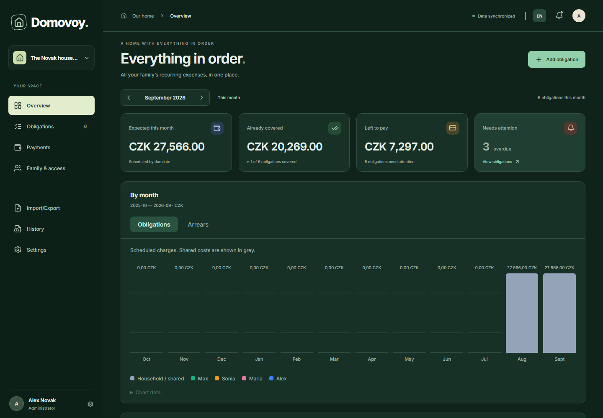
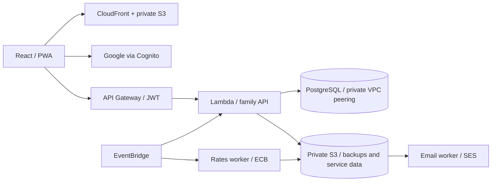

# Domovoy

**Recurring household expenses, with a history you can account for.**

[](https://github.com/saintvy/domovoy/actions/workflows/ci.yml)
[](LICENSE)

**[Open Domovoy](https://domovoy.click/)**

Domovoy helps families track subscriptions, rent, utilities and other recurring
commitments. It keeps charges, payments, refunds and unused credit separate, so
the household can see what is due, who benefits and who is responsible.

Built with **React, TypeScript, PostgreSQL and AWS CDK**. The interface supports
Russian and English, light and dark themes, and an installable PWA shell.



_Dashboard captured from the application with fictional test data._

## What it does

- **Recurring obligations:** weekly, monthly, quarterly and yearly schedules,
  effective-dated prices, previews for date changes, and explicit archiving.
- **Payment accounting:** partial payments, refunds, credit carried forward within
  an obligation, and automatic payment records for charges that are already due.
- **Shared households:** Google sign-in, invitations, five permission levels,
  record authorship and revocable sessions across devices.
- **Telegram reminders:** daily reports for responsible members, configurable
  lead days, one-time or daily reminders, and local report times with DST handling.
  Requires [Telegram deployment setup](docs/telegram-reminders.md).
- **Multiple currencies:** original amounts alongside historical valuations in a
  household currency, using ECB reference rates.
- **Useful views:** monthly summaries, beneficiary colors, price history, family
  responsibilities and two CSV reports.

Automatic payments create accounting records; they do not move money through a bank.

## Engineering approach

Financial rules live in a framework-independent domain layer. The server commits
each command batch, household revision and operation receipt in one PostgreSQL
transaction. Revision checks prevent one device from overwriting another;
idempotency receipts make retries safe after a lost response.



The infrastructure reuses an existing PostgreSQL 16 instance in a separate AWS
account. It provisions no new RDS instance, NAT gateway or always-on application
server. This is an explicit deployment tradeoff; a shared database instance is
still an operational dependency and AWS usage is not free.

Read the [architecture and tradeoffs](docs/architecture.md) and
[product specification](docs/product-specification.md).

## Get started

Use Node.js **22.20+**; `.nvmrc` pins the version used by CI.

```sh
git clone https://github.com/saintvy/domovoy.git
cd domovoy
npm ci
npm run build
npm run test:quick
```

Builds and automated browser tests need no AWS credentials or real Google account.
To inspect the sign-in screen locally, run `npm run dev:client` and open
<http://127.0.0.1:5173/>.

For an authenticated development session, start Docker and configure a public
Cognito client using [the local development guide](docs/local-development.md),
then run `npm run dev`. This starts PostgreSQL 16, the API and Vite. There is no
demo login or authentication bypass; synthetic households exist only in tests.

## Checks

| Command                | Purpose                                                       |
| ---------------------- | ------------------------------------------------------------- |
| `npm run format:check` | Consistent source and documentation formatting                |
| `npm run build`        | TypeScript validation and production frontend build           |
| `npm run test:quick`   | Domain, API, identity, authorization and infrastructure tests |
| `npm run test:scale`   | 500 obligations across 20 years in the domain layer           |
| `npm run test:e2e`     | Chromium workflows with isolated test fixtures                |
| `npm run test:pwa`     | Production shell and offline behavior                         |
| `npm run deploy:check` | Build, infrastructure types and four synthesized AWS stacks   |

Install Chromium with `npx playwright install chromium` before browser tests.
CI also runs the real PostgreSQL integration test.
[Verification](docs/verification.md) explains what each suite proves.

## Repository map

| Path             | Responsibility                                                  |
| ---------------- | --------------------------------------------------------------- |
| `src/domain/`    | Billing, payments, currencies, lifecycle rules and validation   |
| `src/client/`    | React UI, authentication, drafts and PWA integration            |
| `src/aws/`       | Family API, PostgreSQL, authorization, backups and workers      |
| `src/server/`    | Portable backup encryption                                      |
| `infra/`         | CDK stacks, deployment checks and database provisioning         |
| `scripts/`       | Local PostgreSQL, API and development tooling                   |
| `tests/`, `e2e/` | Unit, integration, scale and browser regression tests           |
| `docs/`          | Product, architecture, development and operations documentation |

## Status and scope

The application is under active development. The API currently stores a complete
financial snapshot per family, capped at 4 MiB. The large domain fixture is not a
claim about hosted API capacity. Local invitation email delivery and a rehearsed
full database recovery procedure remain open work.

The public project name is **Domovoy**. Existing `brownie` database identifiers,
session keys and deployment stack names remain for compatibility with installed
environments; [architecture](docs/architecture.md#compatibility) explains the boundary.

- [Current capabilities and limitations](docs/implementation-status.md)
- [Deployment guide](docs/deployment.md)
- [Changelog](CHANGELOG.md)
- [Contributing](CONTRIBUTING.md) · [Security policy](SECURITY.md)

## License

[Apache License 2.0](LICENSE). Third-party icons retain their own licenses and
attribution; see [icon attribution](docs/icon-attribution.md).
